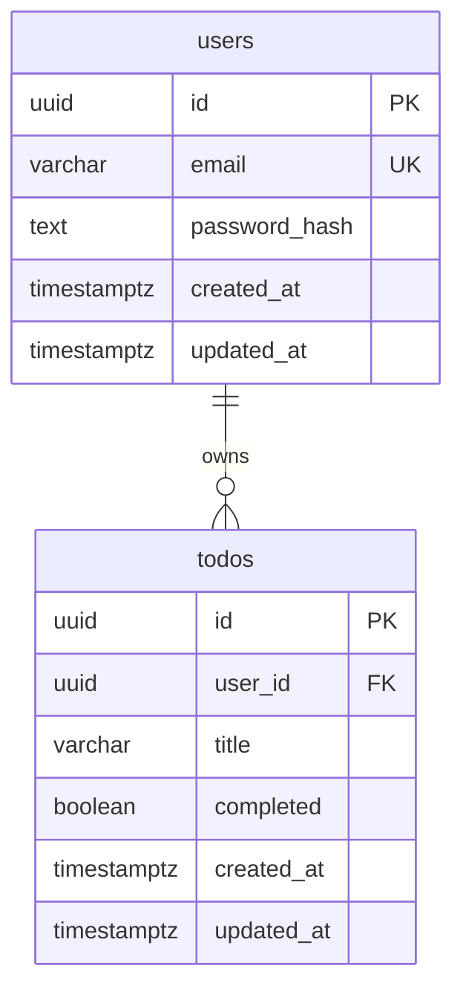

# TodoList 앱 ERD

## 1. Mermaid erDiagram 코드

## 2. 각 테이블의 역할 설명

| 테이블 | 역할 |
| --- | --- |
| `users` | 자체 JWT 인증을 위한 사용자 계정 정보를 저장한다. |
| `todos` | 로그인한 사용자가 작성한 개인 Todo 항목과 완료 상태를 저장한다. |

## 3. 각 컬럼의 타입·제약조건·역할 설명

### 3.1 `users`

| 컬럼 | 타입 | 제약조건 | 역할 |
| --- | --- | --- | --- |
| `id` | `uuid` | `PRIMARY KEY`, `DEFAULT gen_random_uuid()` | 사용자를 식별하는 내부 고유 ID이며 JWT의 subject 또는 user id로 사용한다. |
| `email` | `varchar(255)` | `NOT NULL`, `UNIQUE` | 회원가입과 로그인에 사용하는 이메일이다. 중복 이메일 회원가입을 방지한다. |
| `password_hash` | `text` | `NOT NULL` | 원문 비밀번호가 아니라 bcrypt 또는 argon2 등 안전한 알고리즘으로 해시한 비밀번호를 저장한다. |
| `created_at` | `timestamptz` | `NOT NULL`, `DEFAULT now()` | 사용자 계정 생성 시각을 저장한다. |
| `updated_at` | `timestamptz` | `NOT NULL`, `DEFAULT now()` | 사용자 계정 정보의 마지막 수정 시각을 저장한다. |

### 3.2 `todos`

| 컬럼 | 타입 | 제약조건 | 역할 |
| --- | --- | --- | --- |
| `id` | `uuid` | `PRIMARY KEY`, `DEFAULT gen_random_uuid()` | Todo 항목을 식별하는 내부 고유 ID이다. |
| `user_id` | `uuid` | `NOT NULL`, `FOREIGN KEY REFERENCES users(id) ON DELETE CASCADE` | Todo를 소유한 사용자 ID이다. 서버는 클라이언트 입력값이 아니라 JWT에서 검증한 사용자 ID를 사용해 이 값을 설정하고 조회 조건으로 사용한다. |
| `title` | `varchar(255)` | `NOT NULL`, `CHECK (length(trim(title)) > 0)` | 사용자가 입력한 할 일 내용이다. 빈 문자열 또는 공백만 있는 값으로 Todo가 생성되지 않도록 막는다. |
| `completed` | `boolean` | `NOT NULL`, `DEFAULT false` | Todo 완료 여부를 저장한다. 완료 체크 또는 체크 해제 후 새로고침해도 상태가 유지되도록 한다. |
| `created_at` | `timestamptz` | `NOT NULL`, `DEFAULT now()` | Todo 생성 시각을 저장한다. 전체 목록 조회에서 생성일 기준 정렬에 사용한다. |
| `updated_at` | `timestamptz` | `NOT NULL`, `DEFAULT now()` | Todo 제목 또는 완료 상태의 마지막 수정 시각을 저장한다. |

## 4. 테이블 간 관계 설명

| 관계 | 설명 |
| --- | --- |
| `users` 1 : N `todos` | 한 사용자는 여러 Todo를 가질 수 있고, 각 Todo는 반드시 한 명의 사용자에게 속한다. PRD의 "개인별 할 일 목록", "추가된 할 일은 현재 로그인한 사용자에게만 표시", "다른 사용자의 할 일은 조회·삭제할 수 없음" 요구사항을 만족하기 위해 필요하다. |
| `todos.user_id` -> `users.id` | Todo가 실제 존재하는 사용자에게만 연결되도록 DB 수준에서 보장한다. 백엔드는 JWT에서 검증한 사용자 ID를 기준으로 `todos.user_id`를 설정하고 조회, 완료 변경, 삭제 조건에 함께 사용해 사용자별 데이터 격리를 구현한다. |
| `ON DELETE CASCADE` | 사용자가 삭제되면 해당 사용자의 Todo도 함께 삭제한다. PRD에서 팀 공유, 감사 로그, 복구 기능이 범위 외이므로 MVP에서는 고아 Todo를 남기지 않는 단순한 정책이 적합하다. |
